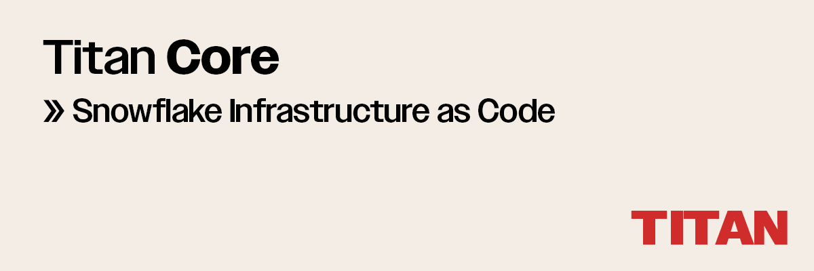

# `Titan Core`



Titan Core helps you provision, automate, and deploy resources in Snowflake. It replaces terraform.

Define any resource – users, roles, schemas, databases, integrations, pipes, stages, functions, sprocs – with declarative Python.

## How it works

### Define resources

```Python
from titan.resources import Grant, Role, Warehouse

role = Role(name="transformer")

warehouse = Warehouse(
    name="transforming",
    warehouse_size="large",
    auto_suspend=60,
)

grants = [
    Grant(priv="usage", to=role, on=warehouse),
    Grant(priv="operate", to=role, on=warehouse),
]
```

### Plan and apply
```Python
from titan import Blueprint

bp = Blueprint()
bp.add(
    role,
    warehouse,
    *grants,
)
plan = bp.plan(session)
print(plan) # =>
"""
account:ABC123

  + role "urn::ABC123:role/transformer" {
     + name  = "transformer"
     + owner = "SYSADMIN"
    }

  + warehouse "urn::ABC123:warehouse/transforming" {
     + name           = "transforming"
     + owner          = "SYSADMIN"
     + warehouse_type = "STANDARD"
     + warehouse_size = "LARGE"
     + auto_suspend   = 60
    }

  + grant "urn::ABC123:grant/..." {
     + priv = "USAGE"
     + on   = warehouse "transforming"
     + to   = role "transformer
    }

  + grant "urn::ABC123:grant/..." {
     + priv = "OPERATE"
     + on   = warehouse "transforming"
     + to   = role "transformer
    }
"""
bp.apply(session, plan)
```

## Why use Titan?

Titan provides a simple way to manage your data warehouse. With Titan, you can:

1. **Declarative API**: Describe what you want without the hassle of how to achieve it.

2. **Deferred Execution**: Plan your infrastructure modifications without immediate execution, allowing you to visualize and review changes before they happen.

3. **SQL Compatibility**: Integrate your existing SQL scripts and workflows into Titan, ensuring a smooth transition and continuous functionality.

4. **Type Checking**: Titan ensures that the resources and configurations you define are correctly typed, reducing the chances of runtime errors.

## Titan Core vs Terraform
Terraform limits you to **1 role per provider**. However, Snowflake's access control is designed to use multiple roles. This forces you into a complex multi-provider configuration which results in drift, permission errors, and broken plans.

Titan Core checks which privileges are required to ensure that plans can be applied. When privileges are missing, Titan tells you exactly what to grant. This speeds up development cycles and helps eliminate the use of `ACCOUNTADMIN`. 

Titan also doesn’t use a state file, which provides more accurate plans and eliminates state mismatch issues.


## Titan Core vs Schemachange


## Installation

```SQL
-- AWS
CREATE DATABASE titan;

CREATE STAGE titan.public.titan_aws
  URL = 's3://titan-snowflake/';

EXECUTE IMMEDIATE
  FROM @titan.public.titan_aws/install;
```

Install Titan from GitHub with pip:

```bash
python -m pip install git+https://github.com/teej/titan.git
```

## Get started

Use Titan to create a starter dbt project.

```Python

import os
import snowflake.connector

from titan import Blueprint
from titan.resources import Database, Warehouse, Role, User, RoleGrant

connection_params = {
    "account": os.environ["SNOWFLAKE_ACCOUNT"],
    "user": os.environ["SNOWFLAKE_USER"],
    "password": os.environ["SNOWFLAKE_PASSWORD"],
}


def dbt():
    # Databases
    raw_db = Database(name="RAW")
    analytics_db = Database(name="ANALYTICS")

    # Warehouses
    loading_wh = Warehouse(name="LOADING")
    transforming_wh = Warehouse(name="TRANSFORMING")
    reporting_wh = Warehouse(
        name="REPORTING",
        warehouse_size="SMALL",
        auto_suspend=60,
    )

    # Roles
    loader = Role(name="LOADER")
    transformer = Role(name="TRANSFORMER")
    reporter = Role(name="REPORTER")

    # Users
    user = User(name="TEEJ", must_change_password=False, default_role=reporter.name)

    # GRANTS
    user_grant = RoleGrant(role=reporter, to_user=user)
    sysadmin_grants = [
        RoleGrant(role=loader, to_role="SYSADMIN"),
        RoleGrant(role=transformer, to_role="SYSADMIN"),
        RoleGrant(role=reporter, to_role="SYSADMIN"),
    ]

    return (
        raw_db,
        analytics_db,
        loading_wh,
        transforming_wh,
        reporting_wh,
        loader,
        transformer,
        reporter,
        user,
        user_grant,
        *sysadmin_grants,
    )


if __name__ == "__main__":
    bp = Blueprint(
        name="dbt-quickstart",
        account=os.environ["SNOWFLAKE_ACCOUNT"],
    )
    bp.add(*dbt())
    session = snowflake.connector.connect(**connection_params)
    plan = bp.plan(session)
    
    # Update Snowflake to match blueprint
    bp.apply(session, plan)

```
