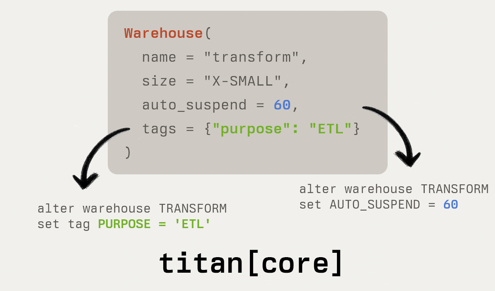

# `titan core` - Snowflake infrastructure as code

<!-- <div align="center">
    
</div> -->

Titan Core helps you provision, deploy, and secure resources in Snowflake. It replaces tools like Terraform, Schemachange, or Permifrost.

Deploy any Snowflake resource, including users, roles, schemas, databases, integrations, pipes, stages, functions, stored procedures, and more. Convert adhoc, bug-prone SQL management scripts into simple, repeatable configuration.

Titan Core is for:

* DevOps engineers looking to automate and manage Snowflake infrastructure.
* Analytics engineers working with dbt who want to manage Snowflake resources without macros.
* Data engineers needing a reliable tool for deploying and managing Snowflake resources.
* Organizations that prefer a git-based workflow for infrastructure management.
* Teams seeking to replace Terraform for Snowflake-related tasks.

```
    ╔══════════╗                                           ╔═══════════╗       
    ║  CONFIG  ║                                           ║ SNOWFLAKE ║       
    ╚══════════╝                                           ╚═══════════╝       
 ┏━━━━━━━━━━━┓                                        ┏━━━━━━━━━━━┓            
┌┫ WAREHOUSE ┣──────┐                                ┌┫ WAREHOUSE ┣───────────┐
│┗━━━━━━━━━━━┛      │                    ALTER       │┗━━━━━━━━━━━┛           │
│ name:         ETL │─────┐           ┌─ WAREHOUSE ─▶│ name:         ETL      │
│ auto_suspend: 60  │     │           │              │ auto_suspend: 300 -> 60│
└───────────────────┘  ╔══▼═══════════╩═╗            └────────────────────────┘
                       ║                ║                                      
                       ║   TITAN CORE   ║                                      
  ┏━━━━━━┓             ║                ║              ┏━━━━━━┓                
┌─┫ ROLE ┣──────────┐  ╚══▲═══════════╦═╝            ┌─┫ ROLE ┣───────────────┐
│ ┗━━━━━━┛          │     │           │              │ ┗━━━━━━┛               │
│ name: TRANSFORMER │─────┘           └─ CREATE ────▶│ name: TRANSFORMER      │
└───────────────────┘                    ROLE        └────────────────────────┘
```


## Key Features

 * **Declarative** » Generates the right SQL to make your config and account match

 * **Comprehensive** » Nearly every Snowflake resource is supported

 * **Pythonic** » Written in Python so you can use it with your existing Python workflow

 * **Fast** » Titan Core runs in seconds, even with complex environments

 * **SQL** » The only tool that allows you to write Python, YAML, or SQL

## Open Source

This project is licensed under the Apache 2.0 License - see [LICENSE](LICENSE) for details. The source code for Titan Core is available on [Github](https://github.com/Titan-Systems/titan).

## Documentation

You can find comprehensive [Titan Core documentation on GitBook](https://titan-core.gitbook.io/titan-core).

## Getting Started

If you're new, the best place to start is with the Python package.

### Python + CLI Installation

### Install from PyPi

```sh
python -m venv .venv
# linux / mac:
source .venv/bin/activate
# windows:
.\.venv\Scripts\activate
python -m pip install titan-core
```

### Using the Python package

```Python
import os
import snowflake.connector

from titan.blueprint import Blueprint, print_plan
from titan.resources import Grant, Role, Warehouse

# Configure resources by instantiating Python objects.

role = Role(name="transformer")

warehouse = Warehouse(
    name="transforming",
    warehouse_size="large",
    auto_suspend=60,
)

usage_grant = Grant(priv="usage", to=role, on=warehouse)

# Titan compares your config to a Snowflake account. Create a Snowflake 
# connection to allow Titan to connect to your account.

connection_params = {
    "account": os.environ["SNOWFLAKE_ACCOUNT"],
    "user": os.environ["SNOWFLAKE_USER"],
    "password": os.environ["SNOWFLAKE_PASSWORD"],
    "role": "SYSADMIN",
}
session = snowflake.connector.connect(**connection_params)

# Create a Blueprint and pass your resources into it. A Blueprint helps you
# validate and deploy a set of resources.

bp = Blueprint(resources=[
    role,
    warehouse,
    usage_grant,
])

# Blueprint works like Terraform. Calling plan(...) will compare your config
# to the state of your Snowflake account and return a list of changes.

plan = bp.plan(session)
print_plan(plan) # =>
"""
» titan core
» Plan: 4 to add, 0 to change, 0 to destroy.

+ urn::ABCD123:warehouse/transforming {
  + name                                = "transforming"
  + owner                               = "SYSADMIN"
  + warehouse_type                      = "STANDARD"
  + warehouse_size                      = "LARGE"
  ...
}

+ urn::ABCD123:role/transformer {
  + name    = "transformer"
  + owner   = "USERADMIN"
  + tags    = None
  + comment = None
}

+ urn::ABCD123:grant/TRANSFORMER?priv=USAGE&on=warehouse/TRANSFORMING {
  + priv         = "USAGE"
  + on           = "transforming"
  + on_type      = "WAREHOUSE"
  + to           = TRANSFORMER
  ...
}
"""

# Calling apply(...) will convert your plan into the right set of SQL commands
# and run them against your Snowflake account.
bp.apply(session, plan) # =>
"""
[TITAN_USER:SYSADMIN]  > USE SECONDARY ROLES ALL
[TITAN_USER:SYSADMIN]  > CREATE WAREHOUSE TRANSFORMING warehouse_type = STANDARD ...
[TITAN_USER:SYSADMIN]  > USE ROLE USERADMIN
[TITAN_USER:USERADMIN] > CREATE ROLE TRANSFORMER
[TITAN_USER:USERADMIN] > USE ROLE SYSADMIN
[TITAN_USER:SYSADMIN]  > GRANT USAGE ON WAREHOUSE transforming TO TRANSFORMER
"""
```

### Using the CLI

You can use the CLI to generate a plan, apply a plan, or export resources. To use the CLI, install the Python package and call `python -m titan` from the command line.

The CLI allows you to `plan` and `apply` a Titan Core YAML config. You can specify a single input file or a directory of configs.

In addition to `plan` and `apply`, the CLI also allows you to `export` resources. This makes it easy to generate a config for an existing Snowflake environment.

To connect with Snowflake, the CLI uses environment variables. These environment variables are supported:

* `SNOWFLAKE_ACCOUNT`
* `SNOWFLAKE_USER`
* `SNOWFLAKE_PASSWORD`
* `SNOWFLAKE_DATABASE`
* `SNOWFLAKE_SCHEMA`
* `SNOWFLAKE_ROLE`
* `SNOWFLAKE_WAREHOUSE`
* `SNOWFLAKE_MFA_PASSCODE`
* `SNOWFLAKE_AUTHENTICATOR`

### CLI Example

```sh
# Show the help message
python -m titan --help

# Usage: python -m titan [OPTIONS] COMMAND [ARGS]...
# 
#   titan core helps you manage your Snowflake environment.
# 
# Options:
#   --help  Show this message and exit.
# 
# Commands:
#   apply   Apply a plan to Titan resources
#   export  Export Titan resources
#   plan    Generate an execution plan based on your configuration

# The CLI uses YAML config. This command creates a sample config file.

cat <<EOF > titan.yml
roles:
  - name: transformer

warehouses:
  - name: transforming
    warehouse_size: LARGE
    auto_suspend: 60

grants:
  - to_role: transformer
    priv: usage
    on_warehouse: transforming
EOF

# Set connection variables
export SNOWFLAKE_ACCOUNT="my-account"
export SNOWFLAKE_USER="my-user"
export SNOWFLAKE_PASSWORD="my-password"

# Generate a plan
python -m titan plan --config titan.yml

# Apply the config
python -m titan apply --config titan.yml
```

The CLI can be used to export your current resource config to a file.

```sh
python -m titan export --resource=warehouse,grant,role --out=titan.yml
```

### Using the GitHub Action
The Titan Core GitHub Action allows you to automate the deployment of Snowflake resources using a git-based workflow.

### GitHub Action Example

```yaml
# .github/workflows/titan.yml
name: Titan Snowflake
on:
  push:
    branches: ["main"]
    # The directory in your repo where titan configs live.
    paths:
    - 'envs/prod/**'


jobs:
  deploy:
    runs-on: ubuntu-latest
    name: Deploy to Snowflake with Titan

    # The Github environment to use
    environment: prod
    steps:
      - uses: actions/checkout@v4
      - name: Deploy with Titan
        id: titan-core-action
        uses: Titan-Systems/titan-core-action@main
        with:
          resource-path: envs/prod
          valid-resource-types: database,user,warehouse,role
        env:
          SNOWFLAKE_ACCOUNT: ${{ secrets.SNOWFLAKE_ACCOUNT }}
          SNOWFLAKE_USERNAME: ${{ secrets.SNOWFLAKE_USERNAME }}
          SNOWFLAKE_PASSWORD: ${{ secrets.SNOWFLAKE_PASSWORD }}
          SNOWFLAKE_ROLE: ${{ secrets.SNOWFLAKE_ROLE }}
          SNOWFLAKE_WAREHOUSE: ${{ secrets.SNOWFLAKE_WAREHOUSE }}
```

## Titan Core Limitations

 - **Titan Core uses names as unique identifiers**. Renaming a resource will create a new one.
 - Titan Core is not an ORM. It's not built to replace tools like SQLAlchemy.
 - Titan Core is under active development. Some resources are not yet supported.


## `titan core` vs other tools

| Feature                                 | Titan Core | Terraform | Schemachange |  Permifrost |
|-----------------------------------------|------------|-----------|--------------| ------------|
| Plan and Execute Changes                | ✅         | ✅        | ❌            | ✅          |
| Declarative Config                      | ✅         | ✅        | ❌            | ✅          |
| Python-Based Definitions                | ✅         | w/ CDKTF  | ❌            | ❌          |
| SQL Support                             | ✅         | ❌        | ✅            | ❌          |
| Dynamic Role Switching                  | ✅         | ❌        | N/A           | ❌          |
| No State File Dependency                | ✅         | ❌        | ✅            | ✅          |


### `titan core` vs Terraform
Terraform is an infrastructure-as-code tool using the HCL config language.

The [Snowflake provider for Terraform](https://github.com/Snowflake-Labs/terraform-provider-snowflake) is limited to **1 role per provider**. This limitation is at odds with Snowflake's design, which is built to use multiple roles. This mismatch forces you into a complex multi-provider setup which can result in drift, permission errors, and broken plans.

Titan Core streamlines this with **dynamic role switching**. Titan Core automatically detects which role is needed for a given change, and switches to that role before making it. This speeds up development cycles and helps eliminate the use of `ACCOUNTADMIN`.

Titan Core doesn't use a state file. This provides more accurate plans and eliminates issues with stale state.


### `titan core` vs Schemachange
[Schemachange](https://github.com/Snowflake-Labs/schemachange) is a database migration tool based on Flyway. It uses SQL scripts to deploy resources to different environments.

Schemachange is an imperative migration tool. For developers, that means you must know Snowflake's current state and the exact SQL commands needed to update it to the desired state. If environments get changed outside of the tool, your migration scripts may need significant adjustments.

Titan Core simplifies this with a declarative approach. With Titan Core, just define what an environment should look like, you don't need to know the detailed steps or SQL commands needed to get there.

Declarative config is less error-prone and more scalable, especially in dynamic and complex data environments.

### `titan core` vs Permifrost
[Permifrost](https://gitlab.com/gitlab-data/permifrost/) is an access-management tool for Snowflake. It helps you automate the creation of users, roles, and grants. Permifrost only manages permissions, it doesn't manage any other aspect of your Snowflake account.

Permifrost can be very slow. Running simple Permifrost configs can take minutes to run. Titan Core is designed to run in seconds, even with complex environments.

## Resource support

### Legend

- ✅ Supported
- 🚧 Unstable
- ❌ Not Yet Supported


| Name                          | Supported |
|-------------------------------|-----------|
| **Account Resources**         |           |
| API Integration               | ✅         |
| Catalog Integration           |           |
| ↳ Glue                        | ✅         |
| ↳ Object Store                | ✅         |
| Compute Pool                  | ✅         |
| Connection                    | ❌         |
| Database                      | ✅         |
| External Access Integration   | ✅         |
| External Volume               | ❌         |
| Failover Group                | 🚧         |
| Grant                         |           |
| ↳ Future Grant                | ✅         |
| ↳ Privilege Grant             | ✅         |
| ↳ Role Grant                  | ✅         |
| Network Policy                | ✅         |
| Notification Integration      |            |
| ↳ Email                       | 🚧         |
| ↳ AWS                         | 🚧         |
| ↳ Azure                       | 🚧         |
| ↳ GCP                         | 🚧         |
| Replication Group             | 🚧         |
| Resource Monitor              | ✅         |
| Role                          | ✅         |
| Role Grant                    | ✅         |
| Security Integration          |            |
| ↳ External API                | ❌         |
| ↳ External OAuth              | ❌         |
| ↳ Snowflake OAuth             | 🚧         |
| ↳ SAML2                       | ❌         |
| ↳ SCIM                        | ❌         |
| Share                         | ✅         |
| Storage Integration           |           |
| ↳ AWS                         | ✅         |
| ↳ Azure                       | ✅         |
| ↳ GCS                         | ✅         |
| User                          | ✅         |
| Warehouse                     | ✅         |
|                               |            |
| **Database Resources**        |            |
| Database Role                 | ✅         |
| Schema                        | ✅         |
|                               |            |
| **Schema Resources**          |            |
| Aggregation Policy            | ✅         |
| Alert                         | ✅         |
| Dynamic Table                 | ✅         |
| Event Table                   | ✅         |
| External Function             | 🚧         |
| External Table                | ❌         |
| File Format                   |           |
| ↳ CSV                         | ✅         |
| ↳ JSON                        | ✅         |
| ↳ AVRO                        | ❌         |
| ↳ ORC                         | ❌         |
| ↳ Parquet                     | ✅         |
| Hybrid Table                  | 🚧         |
| Iceberg Table                 | ❌         |
| Image Repository              | ✅         |
| Masking Policy                | ❌         |
| Materialized View             | 🚧         |
| Model                         | ❌         |
| Network Rule                  | ✅         |
| Packages Policy               | ✅         |
| Password Policy               | ✅         |
| Pipe                          | ✅         |
| Projection Policy             | ❌         |
| Row Access Policy             | ❌         |
| Secret                        |            |
| ↳ Generic                     | ✅         |
| ↳ OAuth                       | ✅         |
| ↳ Password                    | ✅         |
| Sequence                      | ✅         |
| Service                       | ✅         |
| Session Policy                | ✅         |
| Stage                         | ✅         |
| ↳ External                    | ✅         |
| ↳ Internal                    | ✅         |
| Stored Procedure              |            |
| ↳ Java                        | ❌         |
| ↳ Javascript                  | ❌         |
| ↳ Python                      | 🚧         |
| ↳ Scala                       | ❌         |
| ↳ SQL                         | ❌         |
| Stream                        |            |
| ↳ External Table              | ❌         |
| ↳ Stage                       | ✅         |
| ↳ Table                       | ✅         |
| ↳ View                        | ✅         |
| Streamlit                     | ❌         |
| Table                         | 🚧         |
| Tag                           | ✅         |
| Task                          | ✅         |
| User-Defined Function         |            |
| ↳ Java                        | ❌         |
| ↳ Javascript                  | 🚧         |
| ↳ Python                      | ✅         |
| ↳ Scala                       | ❌         |
| ↳ SQL                         | ❌         |
| View                          | ✅         |


## Contributing

Contributions are welcome! Titan Core does not require a contributor license agreement.

## The End

If you got this far, don't forget to star this repo.